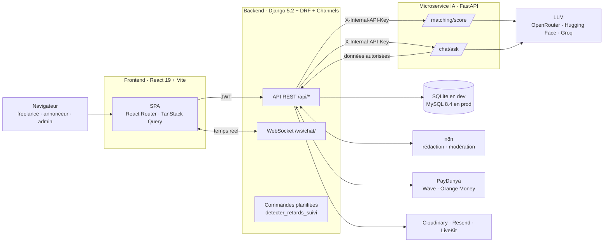

<div align="center">

# TerangaWork

**La plateforme qui met en relation freelances tech et clients au Sénégal, grâce au matching intelligent.**


</div>

---

## Sommaire

1. [Le produit](#le-produit)
2. [Fonctionnalités](#fonctionnalités)
3. [Architecture en un coup d'œil](#architecture-en-un-coup-dœil)
4. [Démarrage rapide](#démarrage-rapide)
5. [Structure du dépôt](#structure-du-dépôt)
6. [Documentation détaillée](#documentation-détaillée)
7. [Versions et releases](#versions-et-releases)
8. [Licence](#licence)

---

## Le produit

TerangaWork (anciennement *Jëfly*) est une plateforme B2B de mise en relation entre **freelances tech** et **annonceurs** (particuliers ou entreprises) au Sénégal.

Elle couvre tout le cycle d'une mission :

```
Publication → Modération → Matching → Candidature → Acceptation
→ Coworking (cadrage puis livrables) → Livraison → Paiement mobile money
```

Deux principes guident toute l'application :

- **L'humain décide.** L'IA et l'automatisation détectent, suggèrent, alertent et exécutent. Elles ne prennent jamais une décision sur un compte, une mission, un livrable ou un paiement : c'est l'annonceur ou l'administrateur qui tranche.
- **Le contexte local.** Le paiement se fait en Wave ou Orange Money (via PayDunya), en FCFA, et l'interface est en français.

Projet de soutenance — Simplon Sénégal, promotion 9 (2025-2026).

## Fonctionnalités

| Domaine | Ce que l'application fait |
|---|---|
| **Comptes** | Inscription, vérification d'email, connexion JWT, choix du rôle (freelance ou annonceur), gestion des sessions actives, mot de passe oublié |
| **Onboarding** | Parcours guidé par étapes : services (1 à 3), technologies, expériences, formations, réalisations, liens GitHub et LinkedIn, photo |
| **Missions** | Publication par l'annonceur avec aide à la rédaction (IA via n8n), modération par l'admin avant mise en ligne, opérateur de paiement choisi à la création |
| **Matching intelligent** | Score pondéré (technologies, service, expérience) puis classement et justification par un LLM. Notification proactive des freelances compatibles à 80 % ou plus |
| **Candidatures** | Lettre de motivation et date de livraison proposée. L'annonceur consulte le profil complet ; une seule candidature peut être acceptée |
| **Coworking** | Suivi par phases : cadrage (3 à 5 jours) puis développement. Livrables validés ou invalidés (commentaire texte ou vocal), historique complet, détection des retards |
| **Messagerie** | Chat temps réel par mission (WebSocket), messages texte et vocaux, accusés de lecture |
| **Visio** | Réunions planifiées dans l'espace projet (LiveKit) |
| **Notifications** | Temps réel via WebSocket, plus de 20 types d'événements |
| **Paiement** | Collecte puis décaissement via PayDunya (Wave et Orange Money), commission prélevée par la plateforme |
| **Assistant Malaw** | Chatbot qui répond à partir des données autorisées de l'utilisateur. Hugging Face en principal, Groq en relais |
| **Administration** | Tableau de bord, modération, référentiels (services, technologies), signalements, demandes d'annulation, relances |

## Architecture en un coup d'œil



- Le **frontend** ne parle qu'au backend Django (REST et WebSocket).
- Le **backend** est la seule source de vérité : base de données, droits, règles métier.
- Le **microservice IA** est sans état. Il reçoit ce que Django lui envoie, calcule, et ne touche jamais directement à la base.

Le détail est dans [docs/ARCHITECTURE.md](docs/ARCHITECTURE.md).

## Démarrage rapide

### Avec Docker (recommandé)

Prérequis : Docker et Docker Compose.

```bash
git clone https://github.com/m3dev4/jefly.git terangawork
cd terangawork

# 1. Configurer les trois services
cp backend/.env.example backend/.env
cp ia/.env.example ia/.env
#    puis renseigner les clés (voir docs/CONFIGURATION.md)

# 2. Lancer
cd backend
docker compose up --build
#    ou, avec MySQL local au lieu de SQLite :
docker compose --profile local up --build
```

| Service | URL |
|---|---|
| Frontend | http://localhost:5173 |
| API Django | http://localhost:8000/api/ |
| Documentation Swagger | http://localhost:8000/api/docs/ |
| Microservice IA | http://localhost:8001/health (exposé en local uniquement) |

### Sans Docker

```bash
# Backend (Python 3.12)
cd backend
python -m venv .venv && source .venv/bin/activate   # Windows : .venv\Scripts\activate
pip install -r requirements.txt
python manage.py migrate
python manage.py createsuperuser
daphne -b 0.0.0.0 -p 8000 config.asgi:application

# Microservice IA (Python 3.11+)
cd ia
python -m venv .venv && source .venv/bin/activate
pip install -r requirements.txt
uvicorn app.main:app --port 8001
#   côté backend : FASTAPI_MATCHING_URL=http://localhost:8001

# Frontend (Node 22, pnpm)
cd frontend
pnpm install
pnpm dev
```

## Structure du dépôt

```
terangawork/
├── frontend/          Application React (SPA)
│   └── src/
│       ├── api/           Appels HTTP (axios), un fichier par domaine
│       ├── components/    Composants réutilisables (landing, chatbot, sidebar…)
│       ├── hooks/         Hooks (auth, WebSocket, notifications, messages…)
│       ├── pages/         Pages routées (auth, espace, admin, workspace…)
│       └── assets/        Images, logos (versions claire et sombre)
├── backend/           API Django
│   ├── config/            Settings, URLs, ASGI (HTTP et WebSocket)
│   ├── User/              Comptes, auth, sessions, onboarding, signalements
│   ├── freelance/         Profil freelance, expériences, formations, réalisations
│   ├── announcer/         Profil annonceur
│   ├── Service/           Référentiel des services
│   ├── Technologie/       Référentiel des technologies
│   ├── mission/           Missions, modération n8n, livraison, paiement
│   ├── proposition/       Candidatures, réunions LiveKit
│   ├── matching/          Pont vers le microservice IA, matching proactif
│   ├── paiement/          PayDunya : collecte, décaissement, webhooks
│   ├── message/           Messagerie temps réel (Channels)
│   ├── notification/      Notifications (base et WebSocket)
│   ├── chatbot/           Conversations de l'assistant, données autorisées
│   ├── suivi/             Coworking : phases, livrables, historique, annulation
│   └── docker-compose.yml Orchestration des services
├── ia/                Microservice FastAPI (matching et assistant)
│   └── app/
├── docs/              Documentation de référence
├── CHANGELOG.md       Historique des versions
└── LICENSE            Licence propriétaire
```

## Documentation détaillée

| Document | Contenu |
|---|---|
| [ARCHITECTURE.md](docs/ARCHITECTURE.md) | Vue d'ensemble, communication entre services, flux métier, modèle de données |
| [BACKEND.md](docs/BACKEND.md) | Apps Django, modèles, liste complète des endpoints, règles métier |
| [FRONTEND.md](docs/FRONTEND.md) | Routes, structure, couche API, thème, temps réel |
| [IA.md](docs/IA.md) | Microservice FastAPI : scoring, LLM, assistant, bascule Hugging Face → Groq |
| [CONFIGURATION.md](docs/CONFIGURATION.md) | Toutes les variables d'environnement des trois services |
| [DEPLOIEMENT.md](docs/DEPLOIEMENT.md) | Docker, tâches planifiées, mise en production, checklist |
| [PACKAGES.md](docs/PACKAGES.md) | Dépendances, versions et rôle de chacune |
| [CONTRIBUER.md](docs/CONTRIBUER.md) | Branches, commits, tests, tags et releases |

## Versions et releases

La version courante est **v1.0.0**. Le versionnement suit [SemVer](https://semver.org/lang/fr/) (`MAJEUR.MINEUR.CORRECTIF`).

- L'historique complet est dans [CHANGELOG.md](CHANGELOG.md).
- La procédure de tag et de release est dans [docs/CONTRIBUER.md](docs/CONTRIBUER.md#tags-et-releases).

## Licence

**Logiciel propriétaire et commercial.** Tous droits réservés.

Le code source est confidentiel. Toute utilisation, copie, modification ou distribution sans accord écrit préalable est interdite. Voir [LICENSE](LICENSE).

© 2026 Mouhamed Lo — TerangaWork.
