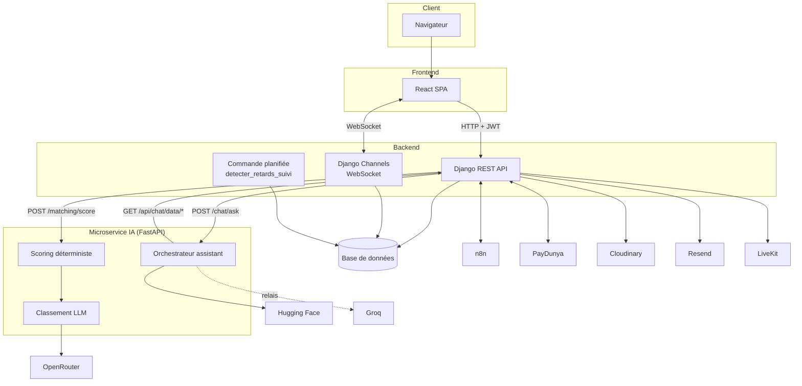
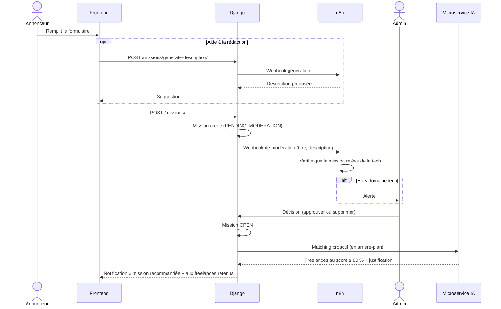
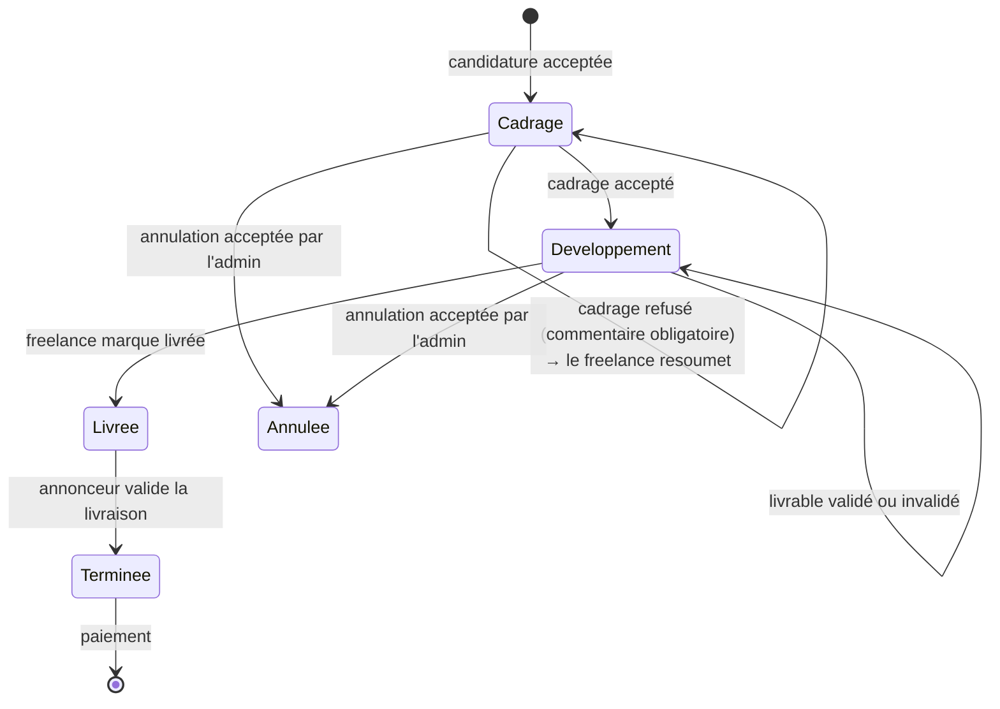
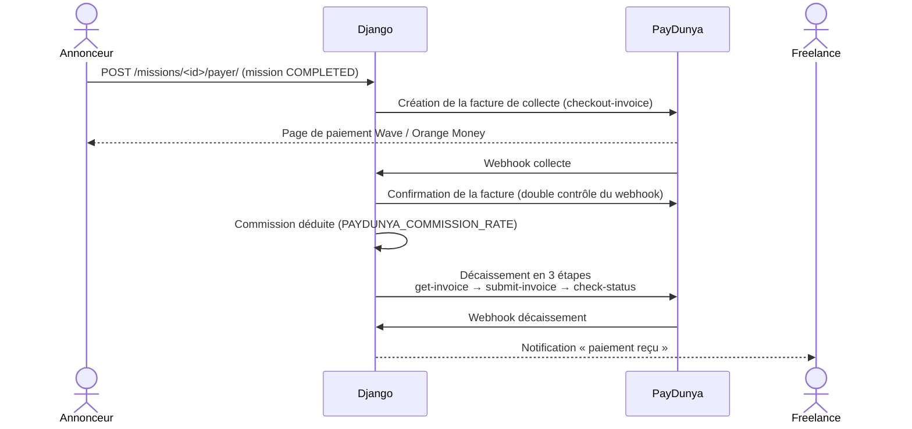
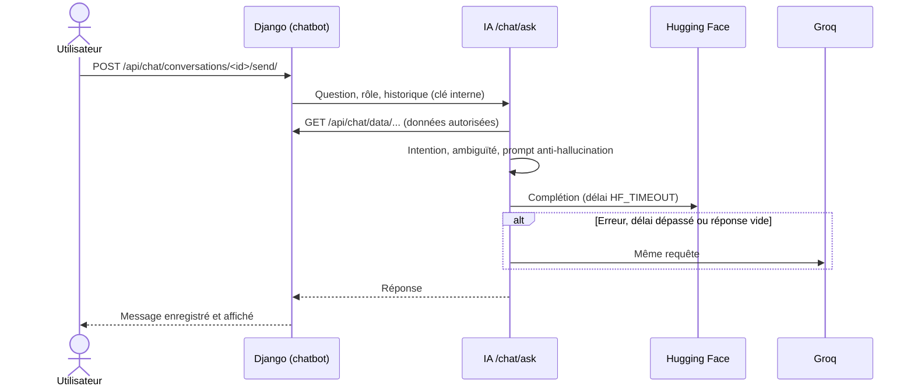
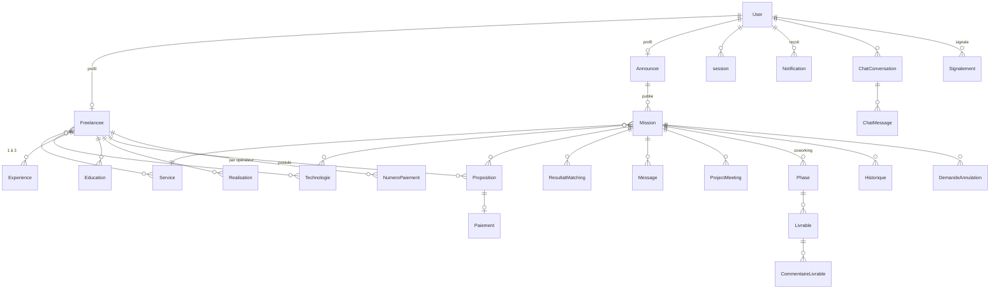

# Architecture

Ce document explique comment TerangaWork est découpé, comment les trois services communiquent et comment se déroulent les principaux parcours.

## 1. Vue d'ensemble

TerangaWork repose sur trois services, plus des services externes.

| Service | Techno | Rôle | Port (dev) |
|---|---|---|---|
| **Frontend** | React 19, Vite 8, TypeScript, Tailwind 4 | Interface pour les freelances, annonceurs et admins | 5173 |
| **Backend** | Django 5.2, DRF, Channels (Daphne) | API REST, WebSocket, base de données, droits et règles métier | 8000 |
| **Microservice IA** | FastAPI, sans état | Scoring et matching, assistant conversationnel | 8001 → 8000 dans Docker |

### Règles d'architecture

1. **Le backend est la source de vérité.** Seul Django lit et écrit la base. Le frontend et l'IA passent toujours par lui.
2. **Le microservice IA est sans état.** Il ne garde rien entre deux appels. Django lui envoie les données nécessaires ; pour l'assistant, l'IA récupère auprès de Django uniquement les données que l'utilisateur a le droit de voir.
3. **L'humain décide (BNF7).** Les automatismes (n8n, IA, commande de retards) détectent, notifient et exécutent des choix humains. Ils ne valident, n'annulent et ne sanctionnent jamais seuls.
4. **Les règles métier vivent dans des services.** Dans les apps récentes (`suivi`, `matching`, `paiement`), les vues vérifient l'identité de l'appelant puis délèguent à `services.py`.

## 2. Communication entre les services

### Frontend → Backend

| Canal | Détail |
|---|---|
| **REST** | `axios` vers `http://localhost:8000/api/` (instance dans `frontend/src/api/axios.ts`). Jeton `Authorization: Bearer <access>` ajouté automatiquement. Sur un 401, le jeton est rafraîchi via `/api/auth/token/refresh/`, puis la requête est rejouée. |
| **WebSocket** | Une seule connexion partagée (`hooks/useWebSocket.ts`) vers `ws://…/ws/chat/`. Elle transporte les messages de chat et les notifications en temps réel. |
| **Cache** | TanStack Query met en cache les lectures et les invalide après chaque mutation. Certaines vues interrogent périodiquement le serveur (suivi de mission, réunions). |

Durée des jetons JWT : 9 h pour l'accès, 14 jours pour le rafraîchissement. Le nombre de sessions actives est limité par `MAX_ACTIVE_SESSIONS` (5 par défaut).

### Backend → Microservice IA

- Django appelle FastAPI en HTTP avec l'en-tête **`X-Internal-API-Key`**. Sa valeur est partagée entre les deux services : `FASTAPI_INTERNAL_API_KEY` côté Django, `INTERNAL_API_KEY` côté IA.
- L'URL de base est `FASTAPI_MATCHING_URL`. Dans Docker, elle vaut `http://ia:8000`.
- Si l'IA ne répond pas, Django dégrade proprement : score seul pour le matching, message d'indisponibilité pour l'assistant.

### Microservice IA → Backend

Pour l'assistant uniquement, FastAPI rappelle Django sur `/api/chat/data/*`, avec la même clé interne, pour récupérer les **données autorisées** de l'utilisateur (ses propositions, ses missions, son profil). L'IA ne voit jamais rien d'autre.

### Services externes

| Service | Utilisé pour | Sens |
|---|---|---|
| **n8n** | Génération de la description d'une mission ; vérification que la mission relève bien de la tech | Django → n8n (webhook) ; n8n → Django (`/api/missions/<id>/moderation/`, protégé par `X-N8N-Secret`) |
| **PayDunya** | Collecte du paiement de l'annonceur et décaissement vers le freelance (Wave, Orange Money) | Django → PayDunya ; PayDunya → Django (webhooks) |
| **OpenRouter** | LLM du matching (classement et justification) | IA → OpenRouter |
| **Hugging Face, puis Groq** | LLM de l'assistant (Groq prend le relais en cas d'échec) | IA → fournisseur |
| **Cloudinary** | Photos de profil et logos de technologies | Django → Cloudinary |
| **Resend** | Emails transactionnels (vérification, mot de passe) | Django → Resend |
| **LiveKit** | Visioconférence de l'espace projet (jetons signés par Django) | Navigateur → LiveKit |

## 3. Parcours principaux

### 3.1 Publication et modération d'une mission

### 3.2 Matching intelligent, en deux étages

1. **Étage 1, scoring déterministe** (`ia/app/scoring.py`) :
   - pondération 45 % technologies, 45 % service, 10 % expérience ;
   - si l'expérience est inconnue, elle n'est pas pénalisée et le calcul passe à 50 % / 50 %.
2. **Étage 2, classement par LLM** (`ia/app/llm_client.py`, via OpenRouter) : un seul appel groupé reclasse les meilleurs candidats et rédige une justification. En cas d'échec, le résultat de l'étage 1 est utilisé tel quel.

| Utilisation | Endpoint Django | Détail |
|---|---|---|
| Compatibilité des missions pour un freelance | `GET /api/matching/missions-compatibilite/` | Étage 1 seul |
| Missions recommandées | `POST /api/matching/missions-recommandees/` | Étages 1 et 2, top 4 |
| Candidats recommandés pour une mission | `POST /api/matching/candidats-recommandes/<id>/` | Étages 1 et 2, top 8 |
| Matching proactif | Déclenché par l'approbation d'une mission | Seuil de 80 %, justification par LLM, notification |

### 3.3 Candidature et acceptation

- Le freelance postule sur une mission `OPEN`, avec une lettre de motivation et une date de livraison au plus tard à la deadline de la mission.
- L'annonceur accepte **une seule** candidature. À l'acceptation :
  - la mission passe `IN_PROGRESS` ;
  - les autres candidatures en attente sont refusées et leurs auteurs notifiés ;
  - la phase de cadrage du coworking s'ouvre.
- Le freelance confirme ensuite son numéro mobile money, pour l'opérateur choisi par l'annonceur.

### 3.4 Coworking : suivi par phases

- **Phase 1, cadrage** : à livrer sous 5 jours (`SUIVI_DELAI_CADRAGE_JOURS`). Les attentes se recueillent via la messagerie.
- **Phase 2, développement** : livrables (titre, lien, description facultative). L'annonceur valide (commentaire facultatif) ou invalide (commentaire obligatoire, texte ou vocal).
- **Retards** : la commande `detecter_retards_suivi`, à lancer chaque jour, notifie l'admin et l'annonceur quand un cadrage ou une livraison est en retard, et l'admin quand un livrable attend une réponse depuis plus de 3 jours. Elle ne décide rien.
- **Annulation** : l'annonceur peut seulement la **demander**. L'admin accepte ou refuse.
- **Historique** : chaque action est tracée dans la table `Historique`, avec son auteur, ou « Système ».

### 3.5 Paiement (PayDunya)

- Les montants sont envoyés en chaînes de caractères. Un second paiement sur la même mission est refusé (409).
- Les statuts de collecte et de décaissement sont suivis séparément.
- `PAYDUNYA_SIMULATE_DISBURSEMENT=True` simule le décaissement en développement.

### 3.6 Assistant Malaw

### 3.7 Temps réel

`config/asgi.py` sert à la fois le HTTP (Django) et le WebSocket (`/ws/chat/` → `message.consumers.ChatConsumer`). Les notifications passent par `notification.services.notifier()`, **seul point** de création d'une notification : la fonction l'enregistre en base puis la pousse sur le groupe `notifications.<user_id>`. En développement, la couche Channels est en mémoire (`InMemoryChannelLayer`) ; en production multi-instance, il faut Redis (`channels-redis` est déjà installé).

## 4. Modèle de données

Le détail des champs de chaque modèle est dans [BACKEND.md](BACKEND.md#modèles).

## 5. Statuts clés

**Mission** (`mission.models.MissionStatus`)

| Statut | Signification |
|---|---|
| `PENDING_MODERATION` | Créée, en attente de l'admin |
| `OPEN` | Publiée, ouverte aux candidatures |
| `IN_PROGRESS` | Candidature acceptée, coworking en cours |
| `DELIVERED` | Le freelance a marqué la mission livrée |
| `COMPLETED` | L'annonceur a validé la livraison ; le paiement est possible |
| `CLOSED` | Fermée |
| `REJECTED` | Rejetée |
| `CANCELLED` | Annulation acceptée par l'admin |

**Proposition** : `PENDING`, `ACCEPTED`, `REJECTED`.

**Livrable** : `A_VALIDER`, `VALIDE`, `INVALIDE`.

**Paiement** : collecte `EN_ATTENTE`, `REUSSI` ou `ECHOUE` ; décaissement `NON_DECLENCHE`, `EN_ATTENTE`, `REUSSI` ou `ECHOUE`.

## 6. Sécurité

| Sujet | Mesure |
|---|---|
| Authentification | JWT (SimpleJWT), sessions suivies et révocables |
| Droits | Vérifiés côté serveur sur chaque action : l'annonceur propriétaire, le freelance assigné ou l'admin (`is_staff`) |
| Statut des missions | Lecture seule dans l'API. Il ne change que via les actions dédiées |
| Mission attribuée | Ne peut plus être modifiée ni supprimée par l'annonceur |
| Inter-services | Clé partagée `X-Internal-API-Key` (Django ↔ IA), secret `X-N8N-Secret` (n8n → Django) |
| Fichiers | Vocaux limités à l'audio (5 Mo maximum), nom de fichier aléatoire (UUID) |
| Paiement | Double vérification des webhooks, idempotence |
