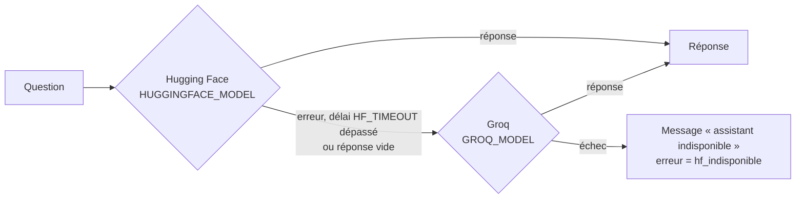

# Microservice IA (FastAPI)

Service **sans état** qui porte toute l'intelligence de TerangaWork :
- le **matching** : scoring et classement par LLM ;
- l'**assistant Malaw** : questions et réponses sur les données de l'utilisateur.

| Élément | Valeur |
|---|---|
| Framework | FastAPI, Uvicorn, Pydantic 2 |
| Python | 3.11 (image Docker) |
| Clients HTTP | httpx (OpenRouter, Groq, Django), `huggingface_hub` (Hugging Face) |
| Sécurité | En-tête `X-Internal-API-Key` exigé sur toutes les routes sauf `/health` |
| Port | 8000 dans le conteneur, exposé en `127.0.0.1:8001` en local |

Ce service ne lit ni n'écrit jamais la base de données. Seul Django l'appelle, et il ne rappelle Django que pour lire les données autorisées de l'assistant.

## Structure

```
ia/app/
├── main.py               Application FastAPI, route /health
├── routes.py             /matching/score et /chat/ask
├── security.py           Vérification de X-Internal-API-Key
├── config.py             Variables d'environnement (pydantic-settings)
├── schemas.py            Schémas du matching
├── scoring.py            Étage 1 : score déterministe
├── llm_client.py         Étage 2 : classement par LLM via OpenRouter, avec repli
├── service.py            Enchaîne les deux étages
├── chat_schemas.py       Schémas de l'assistant
├── chat_orchestrator.py  Intention, ambiguïté, prompt, appel LLM avec bascule
├── django_client.py      Lecture des données autorisées sur /api/chat/data/*
├── huggingface_client.py Client Hugging Face (fournisseur principal)
└── groq_client.py        Client Groq (fournisseur de relais)
```

## Endpoints

| Méthode | Chemin | Description |
|---|---|---|
| GET | `/health` | `{"status": "ok", "service": "matching-intelligent"}` (sans clé) |
| POST | `/matching/score` | Score et classement des candidats |
| POST | `/chat/ask` | Réponse de l'assistant |

La documentation interactive est disponible sur `/docs`, comme pour toute application FastAPI.

### `POST /matching/score`

Requête :

```json
{
  "type_matching": "candidatures",
  "scoring_only": false,
  "contexte": "Description de la mission ou du profil",
  "technologies": ["React", "Django"],
  "services": ["Développement web"],
  "candidats": [
    { "id": 12, "technologies": ["React"], "services": ["Développement web"], "annees_experience": 3, "texte_libre": "…" }
  ],
  "top_n": 8
}
```

Réponse :

```json
{
  "resultats": [
    { "candidat_id": 12, "score": 0.87, "score_technologies": 0.8, "score_service": 1.0,
      "score_experience": 0.6, "justification_ia": "…" }
  ],
  "etage_2_reussi": true
}
```

### `POST /chat/ask`

Requête : `user_id`, `user_role` (`freelance` ou `annonceur`), `user_prenom`, `question`, `conversation_history` (8 derniers échanges).

Réponse : `reponse`, `donnees_utilisees`, `ambiguite_detectee`, `precision_demandee`, `erreur` (`hf_indisponible`, `hf_vide`, `role_inconnu`), `message_user_fr`.

## Matching en deux étages

### Étage 1 : scoring déterministe (`scoring.py`)

| Critère | Poids | Calcul |
|---|---|---|
| Technologies | 45 % | Recouvrement entre les technologies demandées et celles du candidat |
| Service | 45 % | 1 si au moins un service correspond, sinon 0 (un freelance a 1 à 3 services) |
| Expérience | 10 % | Normalisée sur les années d'expérience |

Si l'expérience est inconnue, elle **n'est pas pénalisée** : le score passe à 50 % technologies et 50 % service, pour ne pas désavantager un nouveau freelance.

### Étage 2 : classement par LLM (`llm_client.py`)

- Un **seul** appel groupé à OpenRouter (modèle `OPENROUTER_MODEL`, délai de 10 s) reclasse les `top_n` meilleurs candidats et rédige une justification pour chacun.
- Le prompt s'adapte au type de matching et au destinataire : freelance ou annonceur.
- **Repli** : si la clé manque, si l'API échoue ou si la réponse est invalide, le résultat de l'étage 1 est renvoyé avec `etage_2_reussi: false`.

### Utilisation par Django (`backend/matching/services.py`)

| Cas | `top_n` | Étage 2 |
|---|---|---|
| Compatibilité des missions | toutes | non (`scoring_only`) |
| Missions recommandées à un freelance | 4 | oui |
| Candidats recommandés pour une mission | 8 | oui |
| Matching proactif, à l'approbation d'une mission | freelances au score de 80 % ou plus | oui, pour la justification envoyée dans la notification |

## Assistant Malaw

Déroulé de `chat_orchestrator.orchestrate_chat` :

1. **Rôle** : seuls `freelance` et `annonceur` sont acceptés.
2. **Données autorisées** : appel de Django sur `/api/chat/data/…`, selon le rôle.
3. **Intention** : classée parmi liste ou statut des candidatures, missions acceptées, conseils de profil, missions de l'annonceur, candidatures ou recommandations d'une mission, autre.
4. **Ambiguïté** : si plusieurs missions correspondent à la question, l'assistant demande de préciser au lieu de deviner.
5. **Prompt système anti-hallucination** :
   - uniquement les données fournies ;
   - faits et conseils séparés (« 💡 Conseil : ») ;
   - refus poli des données réservées à l'autre rôle ;
   - réponse en français.
6. **Appel LLM avec bascule** :



Le fournisseur qui a répondu est journalisé (`Réponse assistant fournie par huggingface` ou `groq`).

## Configuration

| Variable | Défaut | Rôle |
|---|---|---|
| `INTERNAL_API_KEY` | `dev-secret-internal-key` | Clé exigée dans `X-Internal-API-Key`, identique à `FASTAPI_INTERNAL_API_KEY` côté Django |
| `DJANGO_BASE_URL` | `http://localhost:8000/api` | API Django, pour les données de l'assistant |
| `DJANGO_INTERNAL_API_KEY` | = `INTERNAL_API_KEY` | Clé utilisée pour appeler Django |
| `OPENROUTER_API_KEY`, `OPENROUTER_MODEL` | `google/gemini-2.5-flash` | LLM du matching |
| `HF_TOKEN`, `HUGGINGFACE_MODEL` | `mistralai/Mistral-7B-Instruct-v0.3` | LLM principal de l'assistant |
| `HF_TIMEOUT` | `30` | Délai maximal en secondes avant de basculer sur Groq |
| `GROQ_API_KEY`, `GROQ_MODEL` | `llama-3.3-70b-versatile` | LLM de relais de l'assistant |
| `GROQ_TIMEOUT` | `20` | Délai maximal de Groq, en secondes |
| `LOG_LEVEL` | `INFO` | Niveau de journalisation |

## Tests

```bash
cd ia
pytest -q                      # tests unitaires (tests/)
pytest -q regression_tests     # régressions du scoring multi-service
```

| Fichier | Couvre |
|---|---|
| `test_scoring.py` | Pondérations, absence d'expérience |
| `test_llm.py` | Étage 2 et repli |
| `test_api.py` | `/health`, contrôle de la clé interne |
| `test_chat_fallback.py` | Bascule Hugging Face → Groq |
